# Balance App - Screen Structure and Navigation

## Document Information
**Date:** 2025-11-07
**Source:** Balance_Home_Screen_Analysis.md
**Purpose:** Complete documentation with two diagrams:
1. Atomic Design Component Structure (Atoms → Molecules → Organisms → Pages)
2. Screen Navigation Flow (Screen-to-screen navigation with triggers)

---

# DIAGRAM 1: Atomic Design Component Structure

This diagram shows the complete component hierarchy and composition relationships following atomic design principles.

```mermaid
erDiagram

%% ═══════════════════════════════════════════════════════════════
%% PAGES (Level 5 - Specific Instances)
%% ═══════════════════════════════════════════════════════════════

page_home {
    LEVEL          string "Page - Specific Instance"
    DESCRIPTION    string "Main landing screen after login - hub for primary actions"
    SCREENELEMENT1 string "organism_app_header"
    SCREENELEMENT2 string "organism_action_card_prescription"
    SCREENELEMENT3 string "organism_action_card_injection"
    SCREENELEMENT4 string "organism_action_card_symptoms"
    SCREENELEMENT5 string "organism_promotional_banner"
    SCREENELEMENT6 string "organism_section_header_appointments"
    SCREENELEMENT7 string "organism_appointment_card"
    SCREENELEMENT8 string "organism_bottom_navigation"
}

page_chat {
    LEVEL          string "Page - Specific Instance"
    DESCRIPTION    string "Messaging screen with coach/nutritionist"
    SCREENELEMENT1 string "organism_app_header"
    SCREENELEMENT2 string "organism_bottom_navigation"
}

page_plan {
    LEVEL          string "Page - Specific Instance"
    DESCRIPTION    string "Progress tracking and treatment plan view"
    SCREENELEMENT1 string "organism_app_header"
    SCREENELEMENT2 string "organism_bottom_navigation"
}

page_profile {
    LEVEL          string "Page - Specific Instance"
    DESCRIPTION    string "User settings and account information"
    SCREENELEMENT1 string "organism_app_header"
    SCREENELEMENT2 string "organism_bottom_navigation"
}

page_prescription_request {
    LEVEL          string "Page - Specific Instance"
    DESCRIPTION    string "Prescription request/refill flow"
    SCREENELEMENT1 string "organism_app_header"
}

page_injection_log {
    LEVEL          string "Page - Specific Instance"
    DESCRIPTION    string "Injection tracking and logging screen"
    SCREENELEMENT1 string "organism_app_header"
}

page_symptom_tracker {
    LEVEL          string "Page - Specific Instance"
    DESCRIPTION    string "Symptom tracking and severity rating screen"
    SCREENELEMENT1 string "organism_app_header"
}

page_appointment_detail {
    LEVEL          string "Page - Specific Instance"
    DESCRIPTION    string "Detailed appointment view with reschedule options"
    SCREENELEMENT1 string "organism_app_header"
    SCREENELEMENT2 string "organism_appointment_card"
}

modal_share_sheet {
    LEVEL          string "Page - Modal Instance"
    DESCRIPTION    string "System share sheet for referral flow"
    SCREENELEMENT1 string "label_share_title"
    SCREENELEMENT2 string "button_share_contact"
}

%% ═══════════════════════════════════════════════════════════════
%% ORGANISMS (Level 3 - Complex UI Components)
%% ═══════════════════════════════════════════════════════════════

organism_app_header {
    LEVEL          string "Organism - Complex Component"
    DESCRIPTION    string "Brand identity and personalized greeting"
    SCREENELEMENT1 string "atom_logo_balance"
    SCREENELEMENT2 string "atom_text_user_greeting"
    SCREENELEMENT3 string "atom_text_welcome_headline"
}

organism_action_card_prescription {
    LEVEL          string "Organism - Complex Component"
    DESCRIPTION    string "Action card for prescription request"
    SCREENELEMENT1 string "molecule_icon_label"
    SCREENELEMENT2 string "molecule_nav_arrow"
}

organism_action_card_injection {
    LEVEL          string "Organism - Complex Component"
    DESCRIPTION    string "Action card for injection logging"
    SCREENELEMENT1 string "molecule_icon_label"
    SCREENELEMENT2 string "molecule_nav_arrow"
}

organism_action_card_symptoms {
    LEVEL          string "Organism - Complex Component"
    DESCRIPTION    string "Action card for symptom tracking with helper text"
    SCREENELEMENT1 string "molecule_icon_label"
    SCREENELEMENT2 string "molecule_nav_arrow"
    SCREENELEMENT3 string "atom_text_helper"
}

organism_promotional_banner {
    LEVEL          string "Organism - Complex Component"
    DESCRIPTION    string "Referral incentive banner with dismissible option"
    SCREENELEMENT1 string "button_close_banner"
    SCREENELEMENT2 string "atom_text_headline_promo"
    SCREENELEMENT3 string "atom_text_body_value_prop"
    SCREENELEMENT4 string "atom_text_body_benefit"
    SCREENELEMENT5 string "atom_text_caption_disclaimer"
    SCREENELEMENT6 string "button_primary_cta"
    SCREENELEMENT7 string "atom_icon_megaphone"
}

organism_section_header_appointments {
    LEVEL          string "Organism - Complex Component"
    DESCRIPTION    string "Section header for upcoming appointments"
    SCREENELEMENT1 string "atom_text_h2"
}

organism_appointment_card {
    LEVEL          string "Organism - Complex Component"
    DESCRIPTION    string "Appointment information card with status indicator"
    SCREENELEMENT1 string "molecule_status_badge"
    SCREENELEMENT2 string "molecule_icon_label_meeting"
    SCREENELEMENT3 string "molecule_professional_info"
}

organism_bottom_navigation {
    LEVEL          string "Organism - Complex Component"
    DESCRIPTION    string "Global navigation bar with four tabs"
    SCREENELEMENT1 string "molecule_nav_tab_home"
    SCREENELEMENT2 string "molecule_nav_tab_chat"
    SCREENELEMENT3 string "molecule_nav_tab_plan"
    SCREENELEMENT4 string "molecule_nav_tab_profile"
}

%% ═══════════════════════════════════════════════════════════════
%% MOLECULES (Level 2 - Simple Component Combinations)
%% ═══════════════════════════════════════════════════════════════

molecule_icon_label {
    LEVEL          string "Molecule - Component Combination"
    DESCRIPTION    string "Icon with adjacent text label"
    SCREENELEMENT1 string "atom_icon"
    SCREENELEMENT2 string "atom_text_body_large"
}

molecule_nav_arrow {
    LEVEL          string "Molecule - Component Combination"
    DESCRIPTION    string "Navigation chevron/arrow indicator"
    SCREENELEMENT1 string "atom_icon_chevron"
}

molecule_status_badge {
    LEVEL          string "Molecule - Component Combination"
    DESCRIPTION    string "Status indicator with dot and label"
    SCREENELEMENT1 string "atom_shape_badge_background"
    SCREENELEMENT2 string "atom_shape_dot_indicator"
    SCREENELEMENT3 string "atom_text_status"
}

molecule_professional_info {
    LEVEL          string "Molecule - Component Combination"
    DESCRIPTION    string "Professional profile with photo, name, and specialty"
    SCREENELEMENT1 string "atom_image_profile"
    SCREENELEMENT2 string "atom_text_professional_name"
    SCREENELEMENT3 string "atom_text_specialty"
}

molecule_icon_label_meeting {
    LEVEL          string "Molecule - Component Combination"
    DESCRIPTION    string "Video icon with meeting type label"
    SCREENELEMENT1 string "atom_icon_video"
    SCREENELEMENT2 string "atom_text_body"
}

molecule_nav_tab_home {
    LEVEL          string "Molecule - Component Combination"
    DESCRIPTION    string "Home navigation tab (active state)"
    SCREENELEMENT1 string "atom_icon_house"
    SCREENELEMENT2 string "atom_text_tab_label"
}

molecule_nav_tab_chat {
    LEVEL          string "Molecule - Component Combination"
    DESCRIPTION    string "Chat navigation tab"
    SCREENELEMENT1 string "atom_icon_message"
    SCREENELEMENT2 string "atom_text_tab_label"
}

molecule_nav_tab_plan {
    LEVEL          string "Molecule - Component Combination"
    DESCRIPTION    string "Plan navigation tab"
    SCREENELEMENT1 string "atom_icon_chart"
    SCREENELEMENT2 string "atom_text_tab_label"
}

molecule_nav_tab_profile {
    LEVEL          string "Molecule - Component Combination"
    DESCRIPTION    string "Profile navigation tab"
    SCREENELEMENT1 string "atom_icon_person"
    SCREENELEMENT2 string "atom_text_tab_label"
}

%% ═══════════════════════════════════════════════════════════════
%% ATOMS (Level 1 - Basic Building Blocks)
%% ═══════════════════════════════════════════════════════════════

%% Text Atoms
atom_text_h1 {
    LEVEL       string "Atom - Text Element"
    DESCRIPTION string "H1 text - welcome message headline"
    SIZE        string "32-36pt"
    WEIGHT      string "Bold"
    COLOR       string "Black"
}

atom_text_h2 {
    LEVEL       string "Atom - Text Element"
    DESCRIPTION string "H2 text - section titles"
    SIZE        string "20-24pt"
    WEIGHT      string "Bold"
    COLOR       string "Black"
}

atom_text_body_large {
    LEVEL       string "Atom - Text Element"
    DESCRIPTION string "Body large text - action card labels"
    SIZE        string "16-18pt"
    WEIGHT      string "Medium"
    COLOR       string "Brown"
}

atom_text_body {
    LEVEL       string "Atom - Text Element"
    DESCRIPTION string "Body regular text"
    SIZE        string "14-16pt"
    WEIGHT      string "Regular"
    COLOR       string "Black"
}

atom_text_user_greeting {
    LEVEL       string "Atom - Text Element"
    DESCRIPTION string "Personalized user greeting"
}

atom_text_welcome_headline {
    LEVEL       string "Atom - Text Element"
    DESCRIPTION string "Welcome headline"
}

atom_text_helper {
    LEVEL       string "Atom - Text Element"
    DESCRIPTION string "Helper/instructional text"
}

atom_text_headline_promo {
    LEVEL       string "Atom - Text Element"
    DESCRIPTION string "Promotional headline (red, bold)"
}

atom_text_body_value_prop {
    LEVEL       string "Atom - Text Element"
    DESCRIPTION string "Value proposition text"
}

atom_text_body_benefit {
    LEVEL       string "Atom - Text Element"
    DESCRIPTION string "Secondary benefit text"
}

atom_text_caption_disclaimer {
    LEVEL       string "Atom - Text Element"
    DESCRIPTION string "Disclaimer text"
}

atom_text_status {
    LEVEL       string "Atom - Text Element"
    DESCRIPTION string "Status label text"
}

atom_text_professional_name {
    LEVEL       string "Atom - Text Element"
    DESCRIPTION string "Professional name"
}

atom_text_specialty {
    LEVEL       string "Atom - Text Element"
    DESCRIPTION string "Professional specialty"
}

atom_text_tab_label {
    LEVEL       string "Atom - Text Element"
    DESCRIPTION string "Navigation tab label"
}

%% Icon Atoms
atom_icon {
    LEVEL       string "Atom - Icon Element"
    DESCRIPTION string "Generic icon element"
    SIZE        string "24-32px"
}

atom_icon_chevron {
    LEVEL       string "Atom - Icon Element"
    DESCRIPTION string "Chevron/arrow right"
}

atom_icon_clipboard {
    LEVEL       string "Atom - Icon Element"
    DESCRIPTION string "Clipboard icon"
}

atom_icon_syringe {
    LEVEL       string "Atom - Icon Element"
    DESCRIPTION string "Syringe icon"
}

atom_icon_notepad {
    LEVEL       string "Atom - Icon Element"
    DESCRIPTION string "Notepad icon"
}

atom_icon_video {
    LEVEL       string "Atom - Icon Element"
    DESCRIPTION string "Video camera icon"
}

atom_icon_house {
    LEVEL       string "Atom - Icon Element"
    DESCRIPTION string "House icon"
}

atom_icon_message {
    LEVEL       string "Atom - Icon Element"
    DESCRIPTION string "Message bubble icon"
}

atom_icon_chart {
    LEVEL       string "Atom - Icon Element"
    DESCRIPTION string "Chart icon"
}

atom_icon_person {
    LEVEL       string "Atom - Icon Element"
    DESCRIPTION string "Person icon"
}

atom_icon_megaphone {
    LEVEL       string "Atom - Icon Element"
    DESCRIPTION string "Megaphone illustration"
}

atom_logo_balance {
    LEVEL       string "Atom - Logo Element"
    DESCRIPTION string "Balance app logo"
}

%% Color Atoms
atom_color_brand_brown {
    LEVEL       string "Atom - Color Token"
    HEX         string "#6B4423"
}

atom_color_beige {
    LEVEL       string "Atom - Color Token"
    HEX         string "#F5E6D3"
}

atom_color_light_peach {
    LEVEL       string "Atom - Color Token"
    HEX         string "#FFF4E8"
}

atom_color_red {
    LEVEL       string "Atom - Color Token"
    HEX         string "#D32F2F"
}

atom_color_white {
    LEVEL       string "Atom - Color Token"
    HEX         string "#FFFFFF"
}

%% Shape Atoms
atom_shape_card_background {
    LEVEL         string "Atom - Shape Token"
    BORDER_RADIUS string "12-16px"
}

atom_shape_badge_background {
    LEVEL         string "Atom - Shape Token"
    BORDER_RADIUS string "16px"
}

atom_shape_dot_indicator {
    LEVEL         string "Atom - Shape Token"
    SIZE          string "8px circle"
}

%% Image Atoms
atom_image_profile {
    LEVEL       string "Atom - Image Element"
    DESCRIPTION string "Circular profile photo"
    SIZE        string "48-56px"
}

%% Interactive Atoms
button_primary_cta {
    LEVEL       string "Atom - Button"
    DESCRIPTION string "Primary CTA button"
}

button_close_banner {
    LEVEL       string "Atom - Button"
    DESCRIPTION string "Close button"
}

button_share_contact {
    LEVEL       string "Atom - Button"
    DESCRIPTION string "Share button"
}

label_share_title {
    LEVEL       string "Atom - Label"
    DESCRIPTION string "Share sheet title"
}

%% ═══════════════════════════════════════════════════════════════
%% COMPOSITION RELATIONSHIPS (Contains)
%% ═══════════════════════════════════════════════════════════════

%% Pages contain Organisms
page_home ||--o{ organism_app_header : "contains"
page_home ||--o{ organism_action_card_prescription : "contains"
page_home ||--o{ organism_action_card_injection : "contains"
page_home ||--o{ organism_action_card_symptoms : "contains"
page_home ||--o{ organism_promotional_banner : "contains"
page_home ||--o{ organism_section_header_appointments : "contains"
page_home ||--o{ organism_appointment_card : "contains"
page_home ||--o{ organism_bottom_navigation : "contains"

page_chat ||--o{ organism_app_header : "contains"
page_chat ||--o{ organism_bottom_navigation : "contains"

page_plan ||--o{ organism_app_header : "contains"
page_plan ||--o{ organism_bottom_navigation : "contains"

page_profile ||--o{ organism_app_header : "contains"
page_profile ||--o{ organism_bottom_navigation : "contains"

page_prescription_request ||--o{ organism_app_header : "contains"
page_injection_log ||--o{ organism_app_header : "contains"
page_symptom_tracker ||--o{ organism_app_header : "contains"

page_appointment_detail ||--o{ organism_app_header : "contains"
page_appointment_detail ||--o{ organism_appointment_card : "contains"

%% Organisms contain Molecules/Atoms
organism_app_header ||--o{ atom_logo_balance : "contains"
organism_app_header ||--o{ atom_text_user_greeting : "contains"
organism_app_header ||--o{ atom_text_welcome_headline : "contains"

organism_action_card_prescription ||--o{ molecule_icon_label : "contains"
organism_action_card_prescription ||--o{ molecule_nav_arrow : "contains"

organism_action_card_injection ||--o{ molecule_icon_label : "contains"
organism_action_card_injection ||--o{ molecule_nav_arrow : "contains"

organism_action_card_symptoms ||--o{ molecule_icon_label : "contains"
organism_action_card_symptoms ||--o{ molecule_nav_arrow : "contains"
organism_action_card_symptoms ||--o{ atom_text_helper : "contains"

organism_promotional_banner ||--o{ button_close_banner : "contains"
organism_promotional_banner ||--o{ atom_text_headline_promo : "contains"
organism_promotional_banner ||--o{ atom_text_body_value_prop : "contains"
organism_promotional_banner ||--o{ atom_text_body_benefit : "contains"
organism_promotional_banner ||--o{ atom_text_caption_disclaimer : "contains"
organism_promotional_banner ||--o{ button_primary_cta : "contains"
organism_promotional_banner ||--o{ atom_icon_megaphone : "contains"

organism_section_header_appointments ||--o{ atom_text_h2 : "contains"

organism_appointment_card ||--o{ molecule_status_badge : "contains"
organism_appointment_card ||--o{ molecule_icon_label_meeting : "contains"
organism_appointment_card ||--o{ molecule_professional_info : "contains"

organism_bottom_navigation ||--o{ molecule_nav_tab_home : "contains"
organism_bottom_navigation ||--o{ molecule_nav_tab_chat : "contains"
organism_bottom_navigation ||--o{ molecule_nav_tab_plan : "contains"
organism_bottom_navigation ||--o{ molecule_nav_tab_profile : "contains"

%% Molecules contain Atoms
molecule_icon_label ||--o{ atom_icon : "contains"
molecule_icon_label ||--o{ atom_text_body_large : "contains"

molecule_nav_arrow ||--o{ atom_icon_chevron : "contains"

molecule_status_badge ||--o{ atom_shape_badge_background : "contains"
molecule_status_badge ||--o{ atom_shape_dot_indicator : "contains"
molecule_status_badge ||--o{ atom_text_status : "contains"

molecule_professional_info ||--o{ atom_image_profile : "contains"
molecule_professional_info ||--o{ atom_text_professional_name : "contains"
molecule_professional_info ||--o{ atom_text_specialty : "contains"

molecule_icon_label_meeting ||--o{ atom_icon_video : "contains"
molecule_icon_label_meeting ||--o{ atom_text_body : "contains"

molecule_nav_tab_home ||--o{ atom_icon_house : "contains"
molecule_nav_tab_home ||--o{ atom_text_tab_label : "contains"

molecule_nav_tab_chat ||--o{ atom_icon_message : "contains"
molecule_nav_tab_chat ||--o{ atom_text_tab_label : "contains"

molecule_nav_tab_plan ||--o{ atom_icon_chart : "contains"
molecule_nav_tab_plan ||--o{ atom_text_tab_label : "contains"

molecule_nav_tab_profile ||--o{ atom_icon_person : "contains"
molecule_nav_tab_profile ||--o{ atom_text_tab_label : "contains"

%% ═══════════════════════════════════════════════════════════════
%% STYLING RELATIONSHIPS (Uses Design Tokens)
%% ═══════════════════════════════════════════════════════════════

organism_action_card_prescription }o--|| atom_color_beige : "uses_background"
organism_action_card_prescription }o--|| atom_shape_card_background : "uses_shape"
organism_action_card_prescription }o--|| atom_icon_clipboard : "uses_icon"

organism_action_card_injection }o--|| atom_color_beige : "uses_background"
organism_action_card_injection }o--|| atom_shape_card_background : "uses_shape"
organism_action_card_injection }o--|| atom_icon_syringe : "uses_icon"

organism_action_card_symptoms }o--|| atom_color_beige : "uses_background"
organism_action_card_symptoms }o--|| atom_shape_card_background : "uses_shape"
organism_action_card_symptoms }o--|| atom_icon_notepad : "uses_icon"

organism_promotional_banner }o--|| atom_color_light_peach : "uses_background"
organism_promotional_banner }o--|| atom_shape_card_background : "uses_shape"

organism_appointment_card }o--|| atom_color_white : "uses_background"
organism_appointment_card }o--|| atom_shape_card_background : "uses_shape"

molecule_status_badge }o--|| atom_color_red : "uses_color"
molecule_nav_tab_home }o--|| atom_color_brand_brown : "uses_active_color"

```

---

# DIAGRAM 2: Screen Navigation Flow

This diagram shows screen-to-screen navigation with UI elements that trigger navigation (simplified view without component details).

```mermaid
erDiagram

%% ═══════════════════════════════════════════════════════════════
%% SCREENS (Navigation-Focused View)
%% ═══════════════════════════════════════════════════════════════

SCN_HOME {
    SCREEN_ID          string "SCN_HOME"
    SCREEN_NAME        string "Home / Inicio"
    DESCRIPTION        string "Main landing screen - hub for primary actions"
    NAV_ELEMENT_1      string "Action Card: Obtener receta"
    NAV_ELEMENT_2      string "Action Card: Registrar inyección"
    NAV_ELEMENT_3      string "Action Card: Registrar síntomas"
    NAV_ELEMENT_4      string "Banner CTA: Invitar ahora"
    NAV_ELEMENT_5      string "Appointment Card"
    NAV_ELEMENT_6      string "Bottom Nav: Chat tab"
    NAV_ELEMENT_7      string "Bottom Nav: Plan tab"
    NAV_ELEMENT_8      string "Bottom Nav: Perfil tab"
}

SCN_CHAT {
    SCREEN_ID          string "SCN_CHAT"
    SCREEN_NAME        string "Chat"
    DESCRIPTION        string "Messaging with coach/nutritionist"
    NAV_ELEMENT_1      string "Bottom Nav: Home tab"
    NAV_ELEMENT_2      string "Bottom Nav: Plan tab"
    NAV_ELEMENT_3      string "Bottom Nav: Perfil tab"
}

SCN_PLAN {
    SCREEN_ID          string "SCN_PLAN"
    SCREEN_NAME        string "Plan"
    DESCRIPTION        string "Progress tracking and treatment plan"
    NAV_ELEMENT_1      string "Bottom Nav: Home tab"
    NAV_ELEMENT_2      string "Bottom Nav: Chat tab"
    NAV_ELEMENT_3      string "Bottom Nav: Perfil tab"
}

SCN_PROFILE {
    SCREEN_ID          string "SCN_PROFILE"
    SCREEN_NAME        string "Perfil"
    DESCRIPTION        string "User settings and account info"
    NAV_ELEMENT_1      string "Bottom Nav: Home tab"
    NAV_ELEMENT_2      string "Bottom Nav: Chat tab"
    NAV_ELEMENT_3      string "Bottom Nav: Plan tab"
}

SCN_PRESCRIPTION_REQUEST {
    SCREEN_ID          string "SCN_PRESCRIPTION_REQUEST"
    SCREEN_NAME        string "Prescription Request"
    DESCRIPTION        string "Request or refill prescription"
    NAV_ELEMENT_1      string "Back button"
    NAV_ELEMENT_2      string "Submit button"
}

SCN_INJECTION_LOG {
    SCREEN_ID          string "SCN_INJECTION_LOG"
    SCREEN_NAME        string "Injection Log"
    DESCRIPTION        string "Log medication administration"
    NAV_ELEMENT_1      string "Back button"
    NAV_ELEMENT_2      string "Save button"
}

SCN_SYMPTOM_TRACKER {
    SCREEN_ID          string "SCN_SYMPTOM_TRACKER"
    SCREEN_NAME        string "Symptom Tracker"
    DESCRIPTION        string "Record symptoms and side effects"
    NAV_ELEMENT_1      string "Back button"
    NAV_ELEMENT_2      string "Save button"
}

SCN_APPOINTMENT_DETAIL {
    SCREEN_ID          string "SCN_APPOINTMENT_DETAIL"
    SCREEN_NAME        string "Appointment Detail"
    DESCRIPTION        string "View and manage appointment"
    NAV_ELEMENT_1      string "Back button"
    NAV_ELEMENT_2      string "Reschedule button"
    NAV_ELEMENT_3      string "Join Call button"
}

MODAL_SHARE_SHEET {
    SCREEN_ID          string "MODAL_SHARE_SHEET"
    SCREEN_NAME        string "Share Sheet"
    DESCRIPTION        string "System share modal for referral"
    NAV_ELEMENT_1      string "Share contact"
    NAV_ELEMENT_2      string "Cancel / Dismiss"
}

%% ═══════════════════════════════════════════════════════════════
%% NAVIGATION RELATIONSHIPS
%% ═══════════════════════════════════════════════════════════════

%% ─── Primary Action Flows from Home ───
SCN_HOME ||--|| SCN_PRESCRIPTION_REQUEST : "TAP: Action Card 'Obtener receta'"
SCN_HOME ||--|| SCN_INJECTION_LOG : "TAP: Action Card 'Registrar inyección'"
SCN_HOME ||--|| SCN_SYMPTOM_TRACKER : "TAP: Action Card 'Registrar síntomas'"
SCN_HOME ||--|| MODAL_SHARE_SHEET : "TAP: Banner CTA 'Invitar ahora'"
SCN_HOME ||--|| SCN_APPOINTMENT_DETAIL : "TAP: Appointment Card"

%% ─── Bottom Navigation (Bidirectional) ───
SCN_HOME ||--|| SCN_CHAT : "TAP: Bottom Nav 'Chat' tab"
SCN_HOME ||--|| SCN_PLAN : "TAP: Bottom Nav 'Plan' tab"
SCN_HOME ||--|| SCN_PROFILE : "TAP: Bottom Nav 'Perfil' tab"

SCN_CHAT ||--|| SCN_HOME : "TAP: Bottom Nav 'Inicio' tab"
SCN_CHAT ||--|| SCN_PLAN : "TAP: Bottom Nav 'Plan' tab"
SCN_CHAT ||--|| SCN_PROFILE : "TAP: Bottom Nav 'Perfil' tab"

SCN_PLAN ||--|| SCN_HOME : "TAP: Bottom Nav 'Inicio' tab"
SCN_PLAN ||--|| SCN_CHAT : "TAP: Bottom Nav 'Chat' tab"
SCN_PLAN ||--|| SCN_PROFILE : "TAP: Bottom Nav 'Perfil' tab"

SCN_PROFILE ||--|| SCN_HOME : "TAP: Bottom Nav 'Inicio' tab"
SCN_PROFILE ||--|| SCN_CHAT : "TAP: Bottom Nav 'Chat' tab"
SCN_PROFILE ||--|| SCN_PLAN : "TAP: Bottom Nav 'Plan' tab"

%% ─── Return Navigation (Back to Home) ───
SCN_PRESCRIPTION_REQUEST ||--|| SCN_HOME : "BACK: Back button or submit"
SCN_INJECTION_LOG ||--|| SCN_HOME : "BACK: Back button or save"
SCN_SYMPTOM_TRACKER ||--|| SCN_HOME : "BACK: Back button or save"
SCN_APPOINTMENT_DETAIL ||--|| SCN_HOME : "BACK: Back button"

%% ─── Modal Dismissal ───
MODAL_SHARE_SHEET ||--|| SCN_HOME : "DISMISS: Share or cancel"

```



---

## Navigation Flow Summary

### User Journey Patterns

#### 1. Hub-and-Spoke (Task Flows)
```
SCN_HOME (Hub)
  ├─→ SCN_PRESCRIPTION_REQUEST → Back to Home
  ├─→ SCN_INJECTION_LOG → Back to Home
  ├─→ SCN_SYMPTOM_TRACKER → Back to Home
  └─→ SCN_APPOINTMENT_DETAIL → Back to Home
```

#### 2. Bottom Navigation (Primary Screens)
```
SCN_HOME ←→ SCN_CHAT ←→ SCN_PLAN ←→ SCN_PROFILE
(All bidirectional via bottom navigation bar)
```

#### 3. Modal Overlay
```
SCN_HOME → MODAL_SHARE_SHEET → Dismiss → SCN_HOME
```

---

## Navigation Triggers Reference

### From SCN_HOME

| UI Element | Destination | Action |
|-----------|-------------|--------|
| Action Card: "Obtener receta" | SCN_PRESCRIPTION_REQUEST | Tap |
| Action Card: "Registrar inyección" | SCN_INJECTION_LOG | Tap |
| Action Card: "Registrar síntomas" | SCN_SYMPTOM_TRACKER | Tap |
| Banner CTA: "Invitar ahora" | MODAL_SHARE_SHEET | Tap |
| Appointment Card | SCN_APPOINTMENT_DETAIL | Tap |
| Bottom Nav: "Chat" | SCN_CHAT | Tap |
| Bottom Nav: "Plan" | SCN_PLAN | Tap |
| Bottom Nav: "Perfil" | SCN_PROFILE | Tap |

### From Task Screens

| UI Element | Destination | Action |
|-----------|-------------|--------|
| Back button | SCN_HOME | Tap |
| Save/Submit button | SCN_HOME (after confirmation) | Tap |

### From Modal

| UI Element | Destination | Action |
|-----------|-------------|--------|
| Share contact | SCN_HOME (dismiss) | Tap |
| Cancel / Swipe down | SCN_HOME (dismiss) | Tap/Gesture |

---

## Atomic Design Hierarchy Summary

### Component Count by Level

- **Atoms (Level 1):** 58 components
  - Text: 15 variants
  - Icons: 11 variants
  - Colors: 5 tokens
  - Shapes: 3 tokens
  - Interactive: 4 buttons/labels
  - Images: 1 element
  - Logo: 1 element

- **Molecules (Level 2):** 10 components
  - icon_label, nav_arrow, status_badge, professional_info
  - icon_label_meeting
  - nav_tab_home, nav_tab_chat, nav_tab_plan, nav_tab_profile

- **Organisms (Level 3):** 8 components
  - app_header
  - action_card_prescription, action_card_injection, action_card_symptoms
  - promotional_banner, section_header_appointments
  - appointment_card, bottom_navigation

- **Pages (Level 4):** 9 screens
  - page_home, page_chat, page_plan, page_profile
  - page_prescription_request, page_injection_log, page_symptom_tracker
  - page_appointment_detail
  - modal_share_sheet

---

## Diagram Usage Guide

### Diagram 1: Atomic Design Structure
**Use this diagram for:**
- Understanding component hierarchy
- Building design system
- Developer component implementation
- Design tokens and styling
- Component reusability analysis

**Key relationships:**
- `contains` - Shows composition hierarchy
- `uses_*` - Shows styling and design token usage

### Diagram 2: Screen Navigation Flow
**Use this diagram for:**
- Understanding user flows
- Navigation implementation
- User journey mapping
- Testing navigation paths
- Product feature planning

**Key relationships:**
- `TAP:` - Tap interaction triggers navigation
- `BACK:` - Back navigation returns to previous screen
- `DISMISS:` - Modal dismissal

---

## Version Information

**Version:** 1.0
**Created:** 2025-11-07
**Source:** Balance_Home_Screen_Analysis.md
**Maintained by:** Product & Engineering Teams

**Related Documents:**
- Balance_Home_Screen_Analysis.md (detailed analysis)
- Balance_App_Flow.md (complete app flows)
- Vision_Balance.md (product vision)
